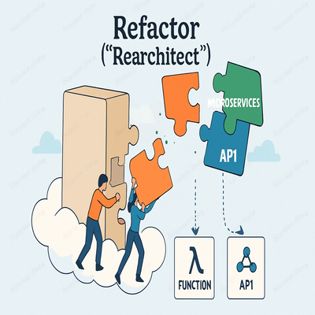

## Important Reasons Why Cloud Migration is Essential

Cloud migration is essential for lowering costs, increasing agility, enhancing security, improving reliability, and enabling access to cutting-edge technology. Organizations migrate to the cloud to future proof their IT, drive innovation, and remain competitive in a rapidly changing digital landscape.

Organizations choose cloud migration—moving their applications, data, and infrastructure from on-premises environments to cloud platforms—for several compelling reasons.

Below are the core motivations, supported by real-world benefits:

### Benefits

- ***Cost Efficiency:***
  - Save money by only paying for what you use and avoiding expensive hardware investments.
- ***Scalability and Flexibility:***
  - Easily increase or decrease resources and serve users anywhere in the world as your needs change.
- ***Improved Security and Compliance:***
  - Leverage strong built-in security measures and meet regulatory standards with cloud providers.
- ***Performance, Reliability, and Availability:***
  - Achieve high uptime and quick disaster recovery by running services across multiple locations.
- ***Business Agility and Innovation:***
  - Enable faster development and innovation by easily testing and launching new ideas.
- ***Competitive Advantage:***
  - Access modern technologies like AI and analytics to stay ahead in your industry.
- ***Operational Efficiency:***
  - Reduce IT maintenance work and improve team collaboration with cloud-based tools.

---

## Legacy Systems vs Cloud Migration: Comparative Table

Below is a practical comparison across key topics—cost, scalability, security, performance, innovation, and operational efficiency with example figures based on recent studies and industry benchmarks.

| **Topic**                          | **Legacy System Example**                        | **Cloud Migration Example**                                     | **Improvement / Notes**                                   |
| ---------------------------------- | ------------------------------------------------ | --------------------------------------------------------------- | --------------------------------------------------------- |
| **Cost Efficiency**                | Annual maintenance:**$150,000** per app          | Annual maintenance:**$90,000** per app (40% savings)            | Pay-as-you-go model, reduced unnecessary expenses         |
| **Scalability**                    | Hardware upgrades require**3-6 months**          | Instantly scalable, add resources in**minutes**                 | Rapid expansion, no physical limitations                  |
| **Security**                       | Patch delays, risk of breaches                   | Automated patching; advanced monitoring;**23% fewer incidents** | Increased protection, continuous updates                  |
| **Performance & Reliability**      | Uptime around**97-98%**; basic disaster recovery | Uptime**99.9-99.99%**; built-in failover & geo-redundancy       | Higher availability, improved disaster recovery           |
| **Business Agility & Innovation**  | New deployments in**weeks or months**            | Deploy in**hours/days**; quick experimentation                  | Faster go-to-market, rapid iteration capabilities         |
| **Operational Efficiency**         | **3-5 IT staff** required per app                | **1-2 IT staff** per app; automation reduces workload           | Smaller teams needed, focus on high-value activities      |
| **Integration & Flexibility**      | Tough API/data integration                       | Easy API support, seamless third-party integration              | Faster digital transformation, improved interoperability  |
| **3-Year Total Cost of Ownership** | **$500,000+** per app                            | **$320,000** per app (36% reduction)                            | Lower long-term spending on hardware, staff, and downtime |

## Find Your Migration Fit - 7 R Strategy

In your cloud migration journey, one size will never fit all workloads. The **7R strategies** offer a practical framework to decide how best to move and transform your legacy applications for the cloud.
This post will help you identify the right migration "fit" for your applications, balancing speed, cost -effectiveness, modernization level, and risk.

### 1\. Rehost ("Lift-and-Shift")

> _Move your applications as they are to the cloud quickly, with minimal changes and risk._

Rehosting means taking your current applications and servers and moving them to cloud infrastructure without changing code or architecture. It offers a fast migration path and reduces your dependency on physical data centers but may carry over legacy inefficiencies. While you don’t tap full cloud-native benefits yet, this strategy lets you start your cloud journey with less upfront investment and disruption.

**Reference Cloud Services**

* **AWS:** [AWS Application Migration Service (MGN)](https://console.aws.amazon.com/mgn/home)
* **Azure:** [Azure Migrate](https://portal.azure.com/#blade/HubsExtension/BrowseResourceBlade/resourceType/Microsoft.Migrate/projects)
* **GCP:** [Migrate for Compute Engine](https://console.cloud.google.com/migrate/compute)

### 2\. Replatform ("Lift-tinker-and-shift")

> _Make minor optimizations like migrating databases to managed cloud services without major architecture changes._

Replatform involves moving applications to the cloud but with small tweaks to improve efficiency—such as switching on-premise databases to managed services or containerizing apps. This balances the speed of rehosting with some gains in cloud performance and cost savings, preparing your application for future modernization steps.

**Reference Cloud Services**

* **AWS:** [AWS Elastic Beanstalk](https://aws.amazon.com/elasticbeanstalk/), [AWS RDS](https://aws.amazon.com/rds/)
* **Azure:** [Azure App Service](https://portal.azure.com/#create/Microsoft.AppServiceWebApp), [Azure SQL Database](https://portal.azure.com/#create/Microsoft.SqlDatabase)
* **GCP:** [Google App Engine](https://console.cloud.google.com/appengine), [Google Cloud SQL](https://console.cloud.google.com/sql)

### 3\. Repurchase

> _Replace legacy apps with new SaaS solutions for automatic updates and modern features._

Repurchasing means moving away from owning and managing applications to subscribing to SaaS models, such as replacing on-premise CRMs with Salesforce or migrating email to Google Workspace. This reduces maintenance overhead, ensures always-updated software, and often results in faster adoption of new capabilities.

**Reference Cloud Services**

* **AWS:** [AWS Marketplace SaaS](https://aws.amazon.com/marketplace/saas)
* **Azure:** [Azure Marketplace SaaS](https://azuremarketplace.microsoft.com/en-us/marketplace/apps?filters=saas)
* **GCP:** [Google Marketplace SaaS](https://console.cloud.google.com/marketplace/browse?filter=solution-type:saas), [Google Workspace](https://workspace.google.com/)

### 4\. Refactor ("Rearchitect")

> _Rebuild applications to fully exploit cloud-native features like serverless, microservices, and event-driven architecture._

Refactoring means redesigning or rewriting core components of your applications to leverage cloud platforms fully. This allows for elastic scalability, cost efficiency, rapid innovation, and resilience that legacy architectures can’t match. Though resource-intensive, refactoring delivers the highest long-term business value and agility.

**Reference Cloud Services**

* **AWS:** [AWS Lambda](https://console.aws.amazon.com/lambda/home), [DynamoDB](https://console.aws.amazon.com/dynamodb/home), [SQS](https://console.aws.amazon.com/sqs/home)
* **Azure:** [Azure Functions](https://portal.azure.com/#create/Microsoft.FunctionApp), [Cosmos DB](https://portal.azure.com/#create/Microsoft.CosmosDBAccount), [Azure Service Bus](https://portal.azure.com/#create/Microsoft.ServiceBusNamespace)
* **GCP:**

  * [Google Cloud Functions](https://console.cloud.google.com/functions),
  * [Firestore](https://console.cloud.google.com/firestore),
  * [Pub/Sub](https://console.cloud.google.com/pubsub)

### 5\. Relocate

> _Move entire virtual machine environments to the cloud without changing applications._

Relocate involves shifting whole infrastructure stacks (like VMware environments) into cloud-managed infrastructure without rearchitecting applications. This is ideal for quick migration with minimal disruption but may not fully optimize cloud benefits.

**Reference Cloud Services**

* **AWS:** [VMware Cloud on AWS](https://aws.amazon.com/vmware/)
* **Azure:** [Azure VMware Solution](https://portal.azure.com/#blade/Microsoft_Azure_VMWare_Cloud/QuickStart)
* **GCP:** [Google Cloud VMware Engine](https://console.cloud.google.com/vmware)

### 6\. Retain

> _Keep some applications on-premises due to technical, regulatory, or business constraints._

Retention means continuing to operate certain workloads in current environments because they are tightly coupled, end-of-life, or subject to compliance rules. It allows incremental migration and risk mitigation but requires careful ongoing management.

**Reference Cloud Services**

* **AWS:** [AWS Outposts](https://aws.amazon.com/outposts/), [AWS Direct Connect](https://aws.amazon.com/directconnect/)
* **Azure:** [Azure Arc](https://azure.microsoft.com/en-us/products/azure-arc/)
* **GCP:** [Google Anthos](https://cloud.google.com/anthos)

### 7\. Retire

> _Decommission applications that are no longer useful to reduce costs and complexity._

Retiring unused or redundant applications eliminates maintenance costs, reduces security risk, and simplifies your environment. It’s a crucial step to clean up before or during migration and can unlock budget for innovation projects.

**Reference Cloud Services**

* Decommissioning is a process; cloud offerings help monitor such workflows, e.g., **AWS Config**, **Azure Advisor**, **Google Operations Suite** for asset tracking and compliance.

---

*The* ***7R framework*** *gives you a dynamic roadmap to tailor your cloud migration strategy based on your unique workloads and goals.
Choosing the right "R" accelerates your journey, reduces risk, and maximizes gains from the cloud.*

---
